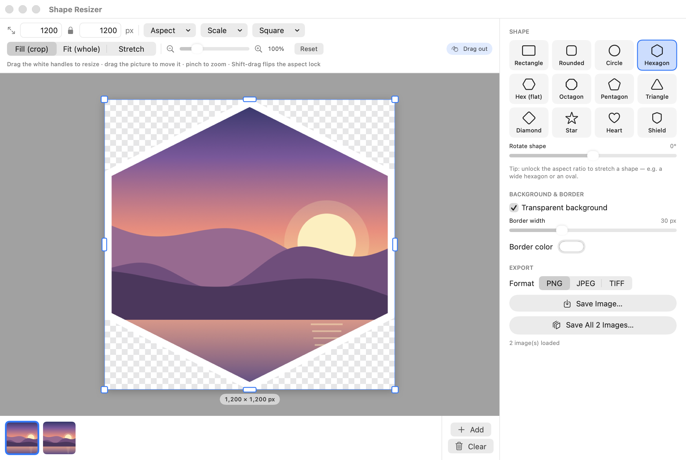
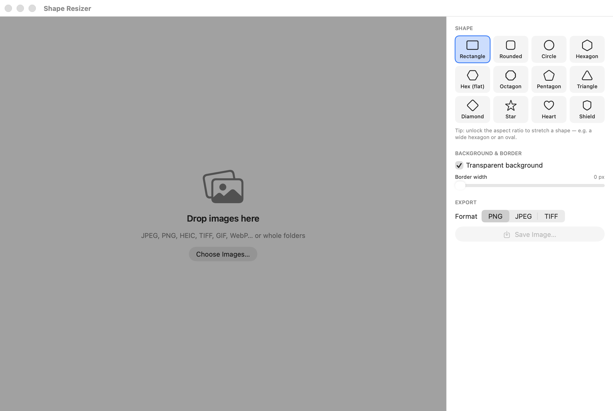
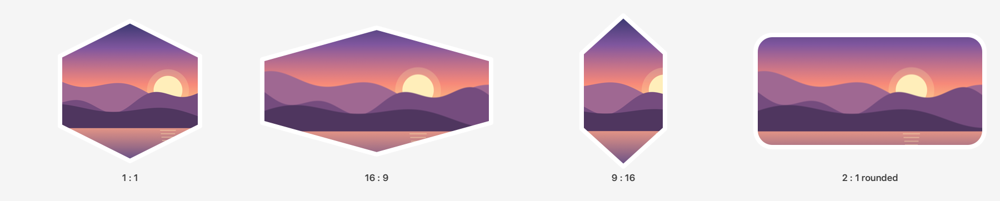
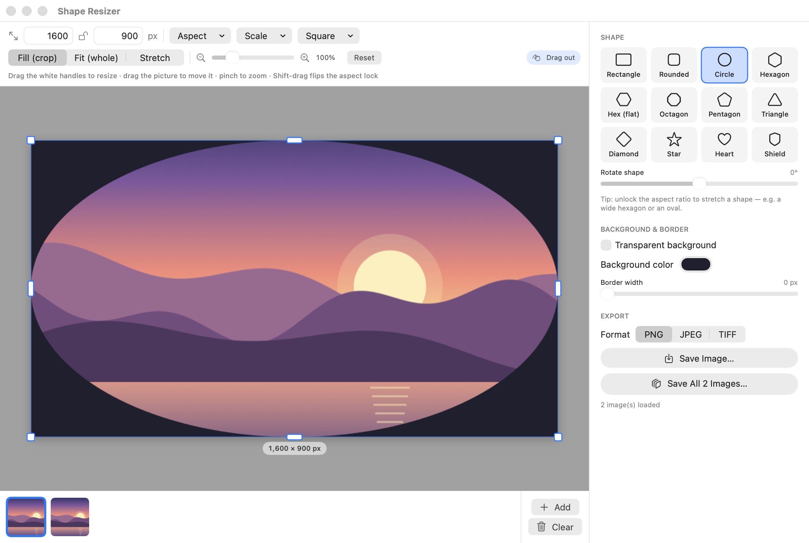
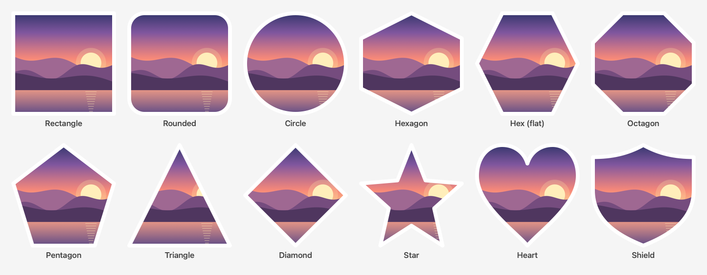
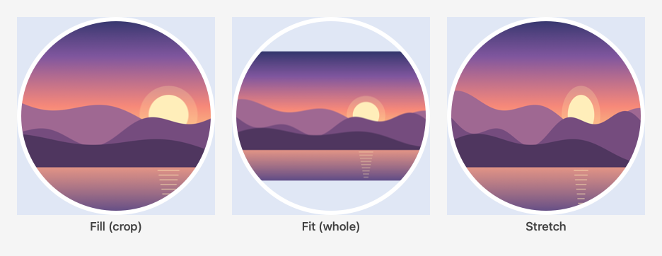

<p align="center">
  
</p>

<h1 align="center">Shape Resizer</h1>

<p align="center">
  A small, native Mac app that resizes images to <b>any size or aspect ratio</b><br>
  and cuts them into <b>shapes</b> — circles, hexagons, stars, hearts and more.
</p>

<p align="center">
  <a href="https://github.com/rickkollins/Image-Shaper/releases/latest"><b>⬇️ Download the latest version</b></a>
  &nbsp;·&nbsp; macOS 14 Sonoma or later &nbsp;·&nbsp; Apple silicon and Intel
</p>



---

## Contents

- [Features](#features)
- [Install](#install)
- [Quick start](#quick-start)
- [Using Shape Resizer](#using-shape-resizer)
  - [Adding images](#adding-images)
  - [Resizing](#resizing)
  - [Shapes](#shapes)
  - [Positioning the picture](#positioning-the-picture)
  - [Background and border](#background-and-border)
  - [Saving](#saving)
- [Keyboard shortcuts](#keyboard-shortcuts)
- [Tips and FAQ](#tips-and-faq)
- [Uninstall](#uninstall)
- [Building from source](#building-from-source)

## Features

- **Drag and drop**: drop images or whole folders onto the window, the Dock icon, or the app icon in Finder
- **Any size, any aspect ratio**: drag resize handles right on the picture, type exact pixel sizes, or use presets (1:1, 4:3, 3:2, 16:9, 21:9, 9:16, 4:5…) and percentage scaling
- **12 shapes**: rectangle, rounded rectangle, circle / oval, hexagon (pointy or flat), octagon, pentagon, triangle, diamond, star, heart and shield, each rotatable
- **Fill, Fit or Stretch** the photo into the shape, then drag to reposition it and pinch to zoom
- **Transparent or colored background**, plus an optional border in any color and width
- **Batch processing**: load many images and save them all at once with the same settings
- **Safe saving**: never overwrites an existing file; a number is added instead
- **PNG, JPEG and TIFF** output, with a JPEG quality setting
- **Drag out**: drag the finished image straight into Finder, Mail, Messages, or any app
- Respects camera rotation (EXIF) and works with JPEG, PNG, HEIC, TIFF, GIF, WebP, BMP and more

## Install

1. Download **`ShapeResizer-1.0.dmg`** from the [Releases page](https://github.com/rickkollins/Image-Shaper/releases/latest).
2. Double-click the DMG to open it.
3. Drag **Shape Resizer** onto the **Applications** folder shortcut next to it.
4. Eject the DMG (click ⏏ next to "Shape Resizer" in the Finder sidebar).
5. Open **Shape Resizer** from Applications or Launchpad.

> [!NOTE]
> **"Apple could not verify Shape Resizer is free of malware"**
>
> Shape Resizer isn't notarized by Apple (that needs a paid Apple Developer account), so macOS warns you the
> first time you open it. To open it anyway:
>
> 1. Click **Done** on the warning.
> 2. Open **System Settings → Privacy & Security**.
> 3. Scroll down to the message about Shape Resizer and click **Open Anyway**.
> 4. Confirm with your password or Touch ID, then click **Open**.
>
> You only need to do this once.

**Want it on your Desktop?** In Finder, hold **⌘ Command + ⌥ Option** and drag Shape Resizer from Applications
to the Desktop. This makes an alias, and you can drop images straight onto it.

## Quick start

1. **Drop** a photo onto the window.
2. **Pick a shape** from the panel on the right.
3. **Set the size**: drag a corner handle, or type a width and height in the toolbar.
4. Press **⌘S** to save.

## Using Shape Resizer

### Adding images



There are several ways to load images:

| How | What happens |
| --- | --- |
| Drag files onto the window | They're added to the strip along the bottom |
| Drag a **folder** onto the window | Every image inside it (including subfolders) is added |
| Drop images onto the **Dock icon** or the app's icon in Finder | The app opens and loads them |
| **File → Open Images…** (⌘O) or **Choose Images…** | Pick files or folders with the standard Open dialog |
| Drag an image out of Safari, Photos or Preview | It's added directly |

The **strip along the bottom** shows every loaded image. Click a thumbnail to preview it, right-click it to
**Remove** it, or use **Clear** to start over. Shape, size and other settings apply to **all** loaded images.
The first image you add sets the starting size to its original pixel dimensions.

### Resizing

All the sizing tools are in the toolbar above the picture and on the picture itself.

**On the picture**

- Drag a **corner handle** to resize in both directions.
- Drag an **edge handle** (the wider handles on each side) to change only the width or only the height.
- The current size is shown in the label under the picture while you drag.
- Hold **⇧ Shift** while dragging to temporarily flip the aspect-ratio lock.

**In the toolbar**

| Control | What it does |
| --- | --- |
| **Width / Height** | Type an exact size in pixels (1 to 16,000), then press Return |
| 🔒 **Lock** | When locked, changing one side changes the other to keep the shape's proportions. Unlock it to use any size you like |
| **Aspect** | Snap to a common ratio: 1:1 square, 4:3, 3:2, 16:9, 21:9, 3:4, 2:3, 9:16 (stories/reels), 4:5 (Instagram portrait), or **Original** |
| **Scale** | 10% to 300% of the original image's size |
| **Square** | One click to 128, 256, 512, 1024, 2048 or 4096 pixels square |

Unlocking the aspect ratio lets you stretch a shape: a circle becomes an oval, and a hexagon can be made wide or tall.





### Shapes

Choose a shape in the **Shape** panel on the right. Everything outside the shape becomes transparent, or your
background color if you choose one.



- **Rounded**: a **Corner radius** slider appears, from square corners (0%) to fully round ends (100%).
- **Every other shape** (except Rectangle): a **Rotate shape** slider turns it from −180° to 180°. The rotated
  shape is scaled so it still fills the image.
- **Hexagon** has a point at the top; **Hex (flat)** has a flat top. Flat hexagons tile nicely for honeycomb layouts.

### Positioning the picture

The toolbar's second row controls how the photo sits inside the shape:



| Mode | Result |
| --- | --- |
| **Fill (crop)** | The picture covers the whole shape; the overflowing edges are cropped. Best for most photos |
| **Fit (whole)** | The whole picture is visible; any leftover space shows the background |
| **Stretch** | The picture is squeezed or stretched to fill the shape exactly |

- **Move**: drag the picture to choose which part is visible, for example to center a face in a circle.
- **Zoom**: pinch on a trackpad, use the zoom slider, or click the 🔍 − / + buttons (25% to 400%).
- **Reset** returns to the default position and 100% zoom.

### Background and border

- **Transparent background** (on by default) leaves everything outside the shape see-through. A checkerboard
  in the preview shows the transparent areas.
- Turn it off to choose a **Background color**. This also fills the empty space in **Fit** mode.
- **Border width** (0 to 100 pixels) draws an outline along the shape, and **Border color** sets its color. The
  border is drawn inside the image, so the final size is exactly what you set.

### Saving

| Option | How |
| --- | --- |
| **Save Image…** (⌘S) | Saves the image you're looking at; you choose the folder and name |
| **Save All *N* Images…** | Appears when more than one image is loaded. Choose a folder, and every image is saved there with the current settings. Finder then opens with the new files selected |
| **Drag out** | Drag the **Drag out** chip in the toolbar into a Finder window, the Desktop, an email, or a chat |

**File formats**

| Format | Transparency | Best for |
| --- | --- | --- |
| **PNG** | ✅ Yes | Shapes with transparent corners, logos, icons, web graphics |
| **JPEG** | ❌ No (transparent areas become white) | Photos where small file size matters; set **Quality** from 10% to 100% |
| **TIFF** | ✅ Yes | Print work and lossless archiving |

**File names** follow the pattern `originalname-WIDTHxHEIGHT-shape.ext`, for example
`beach-1080x1080-circle.png`.

**Nothing is ever overwritten.** If a file with that name already exists, Shape Resizer adds a number
(`beach-1080x1080-circle 2.png`). This happens even if you click "Replace" in the save dialog. Your original
images are never modified.

## Keyboard shortcuts

| Shortcut | Action |
| --- | --- |
| ⌘O | Open images |
| ⌘S | Save the current image |
| ⇧ Shift + drag handle | Temporarily flip the aspect-ratio lock |
| Return | Apply a typed width or height |
| ⌘Q | Quit |

## Tips and FAQ

**How do I make a round profile picture?**
Choose **Circle**, click **Square → 512 × 512** (or 1024), use **Fill**, then drag the photo so the face is
centered. Save as **PNG** to keep the corners transparent.

**Why are the corners white instead of transparent?**
JPEG can't store transparency. Switch the format to **PNG** or **TIFF**.

**My saved image looks blurry.**
Check the size in the toolbar. Making an image much larger than its original (for example 300% of a small
photo) can't add detail that isn't there. The **Scale → 100%** option shows the original size.

**Can I process a whole folder?**
Yes. Drop the folder onto the window, set up the size and shape once, then click **Save All**.

**What's the largest size?**
16,000 × 16,000 pixels.

**Does it change my original photos?**
No. Originals are only read; results are always saved as new files.

**Does it upload my images anywhere?**
No. Everything happens on your Mac, and the app makes no network connections.

## Uninstall

Drag **Shape Resizer** from Applications to the Trash. It doesn't install anything else.

## Building from source

You need macOS 14 or later and the Xcode Command Line Tools (run `xcode-select --install` if you don't have them).
Full Xcode is not required.

```bash
git clone https://github.com/rickkollins/Image-Shaper.git
```

```bash
cd Image-Shaper && ./build.sh
```

This creates `build/Shape Resizer.app` as a universal binary (Apple silicon + Intel). To package a DMG:

```bash
./make-dmg.sh
```

The DMG is written to `dist/ShapeResizer-<version>.dmg`. The version comes from `CFBundleShortVersionString` in
`build.sh`.

To regenerate the screenshots in this README (rendered from the real app UI, offscreen):

```bash
./tools/screenshots.sh
```

### Project layout

| Path | Purpose |
| --- | --- |
| `ShapeResizer.swift` | The entire app: shape geometry, image rendering (CoreGraphics / ImageIO), and the SwiftUI interface |
| `MakeIcon.swift` | Draws the app icon |
| `build.sh` | Compiles a universal `.app` bundle with its icon and `Info.plist`, then ad-hoc signs it |
| `make-dmg.sh` | Builds the app and wraps it in a drag-to-install DMG |
| `tools/screenshots.sh`, `tools/Screenshots.swift` | Render the README images into `docs/` |
| `docs/` | Images used in this README |

### How it works

Each shape is a `CGPath` scaled to fill the output size, which is why shapes stretch with the aspect ratio.
The photo is drawn into an sRGB bitmap, clipped to that path, with high-quality interpolation. The border is
stroked inside the edge so the output is exactly the requested size. The preview uses the same renderer at a
smaller scale, so what you see is what you save.
